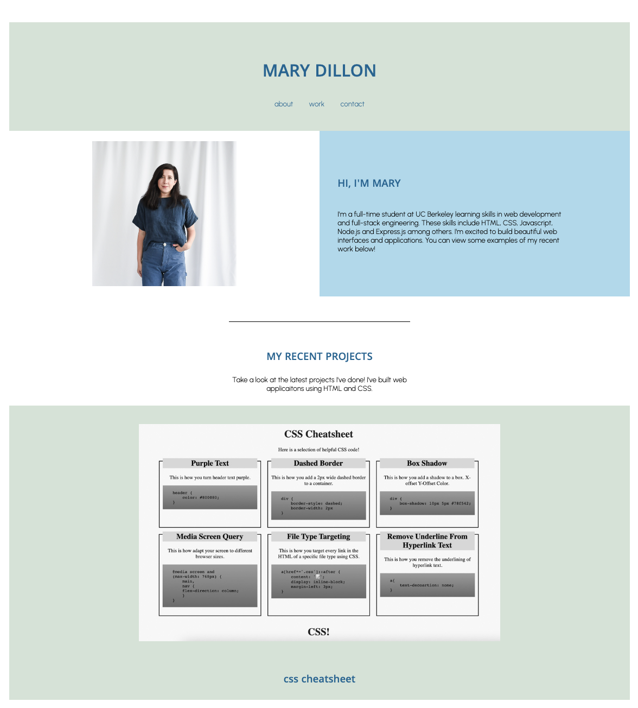
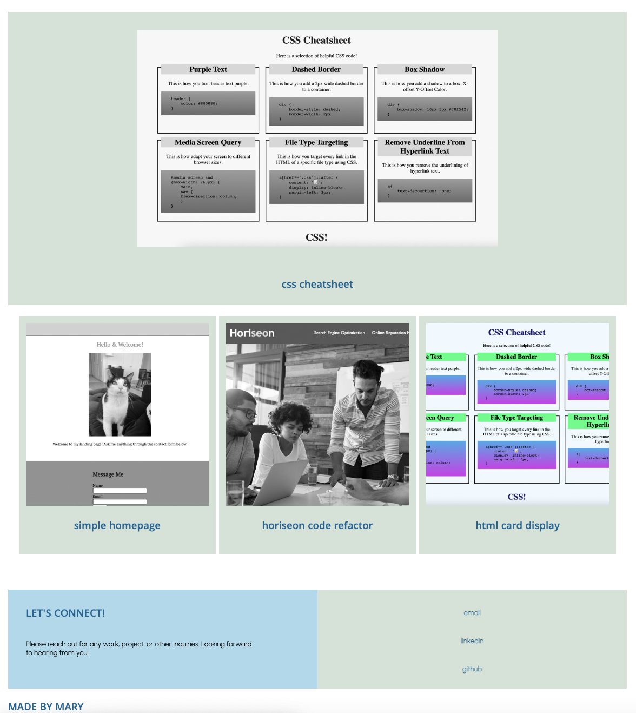
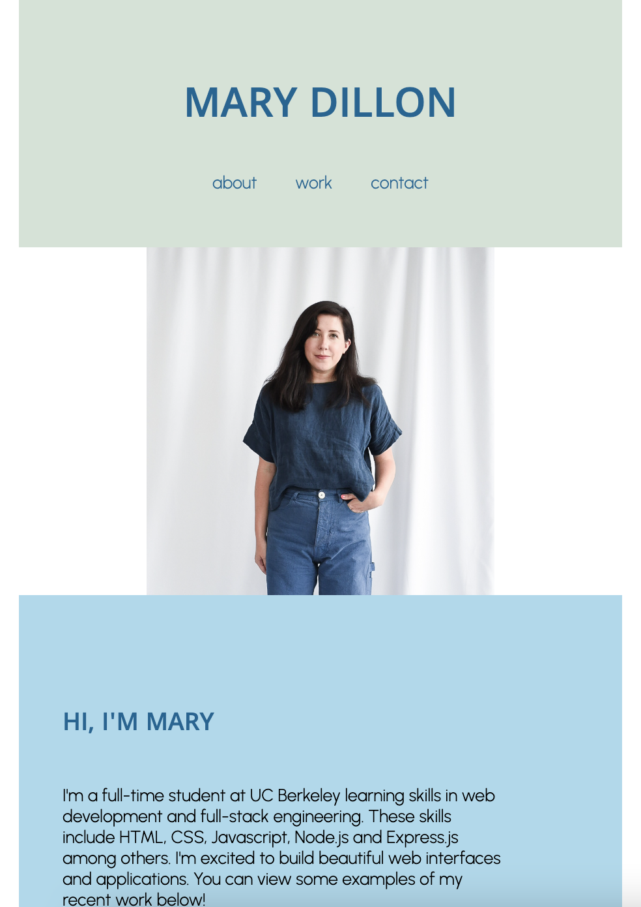
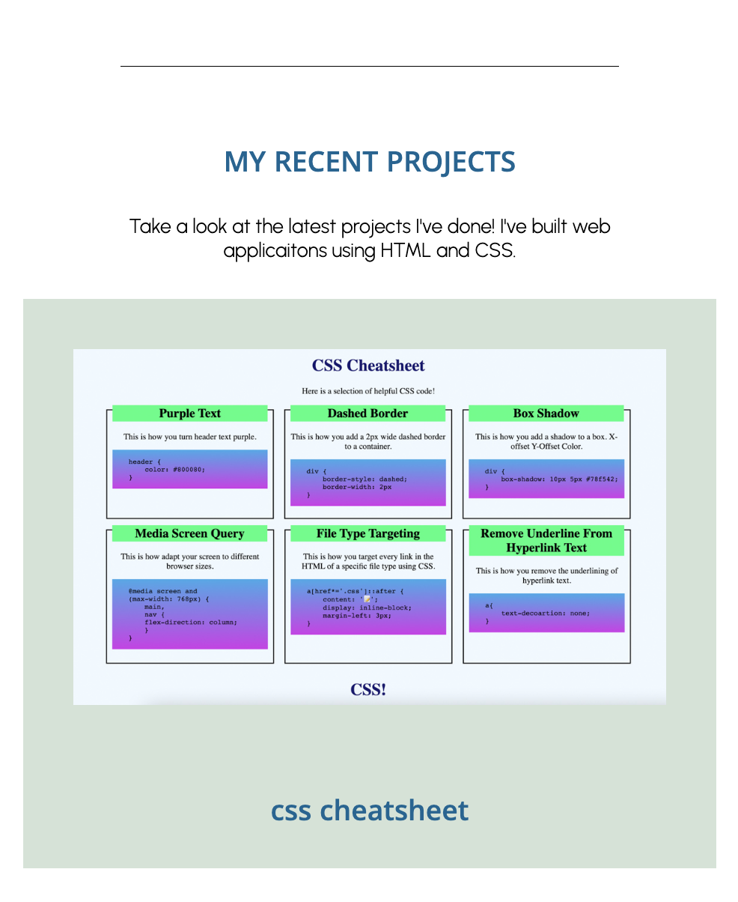
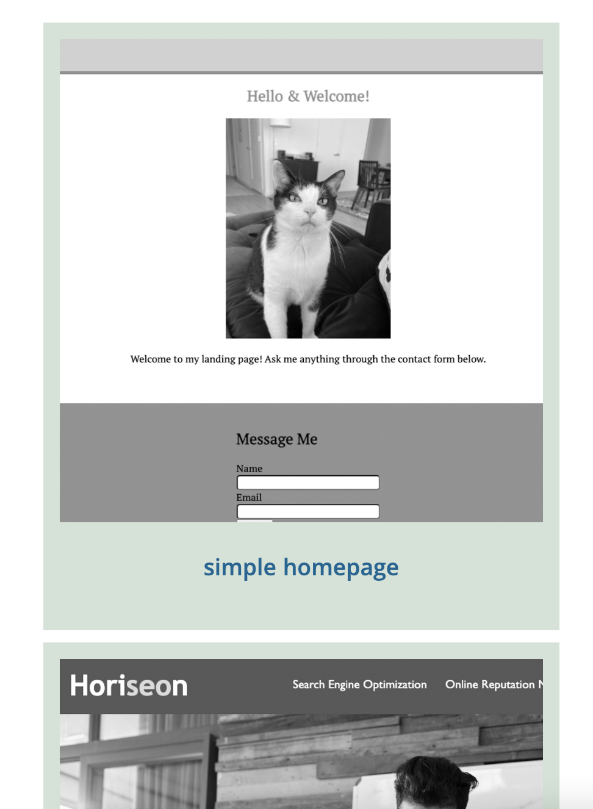
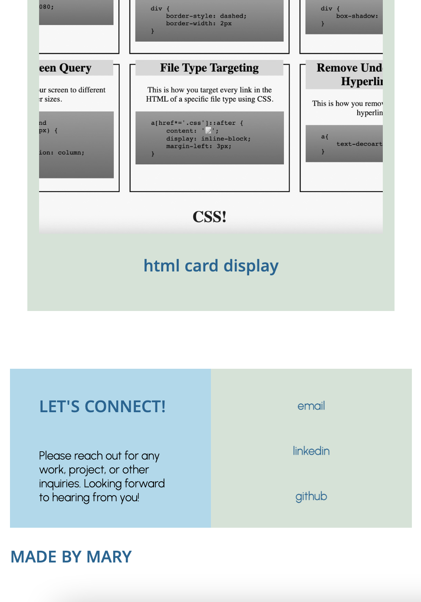

# mary-dillon-portfolio

## Description

This code creates a simple web developer portfolio. 

It conatins five sections:

A header with links to each section as well as a large title with portfolio's author's. 

A two column about me section. One half to display a photo of the author and one half for a concise about me description. The description section has input for a short intro above the content.

A section to display four work examples with one being highlighted above the other three. Use the highlighted section to display a prominent project. There are then three equally sized cards for other work examples that link to the work directly. 

The last section is a two column container with links to contact information or any sites to access the portfolio author. 

## Installation

This code can be used with any application that runs HTML and CSS in a browser.

## Usage

This simple web developer portfolio is for anyone to create a quick bio and showcase their work and projects they've built. It can be used to send to potential employers or partners to easily and quickly display skills in html and css. 

Sections are dynamic with browser sizes. For smaller browsers, sections shrink and stack abover each other. 

### Display Desktop

### Display Mobile

## License
MIT License

Copyright (c) 2022 mardill

Permission is hereby granted, free of charge, to any person obtaining a copy
of this software and associated documentation files (the "Software"), to deal
in the Software without restriction, including without limitation the rights
to use, copy, modify, merge, publish, distribute, sublicense, and/or sell
copies of the Software, and to permit persons to whom the Software is
furnished to do so, subject to the following conditions:

The above copyright notice and this permission notice shall be included in all
copies or substantial portions of the Software.

THE SOFTWARE IS PROVIDED "AS IS", WITHOUT WARRANTY OF ANY KIND, EXPRESS OR
IMPLIED, INCLUDING BUT NOT LIMITED TO THE WARRANTIES OF MERCHANTABILITY,
FITNESS FOR A PARTICULAR PURPOSE AND NONINFRINGEMENT. IN NO EVENT SHALL THE
AUTHORS OR COPYRIGHT HOLDERS BE LIABLE FOR ANY CLAIM, DAMAGES OR OTHER
LIABILITY, WHETHER IN AN ACTION OF CONTRACT, TORT OR OTHERWISE, ARISING FROM,
OUT OF OR IN CONNECTION WITH THE SOFTWARE OR THE USE OR OTHER DEALINGS IN THE
SOFTWARE.